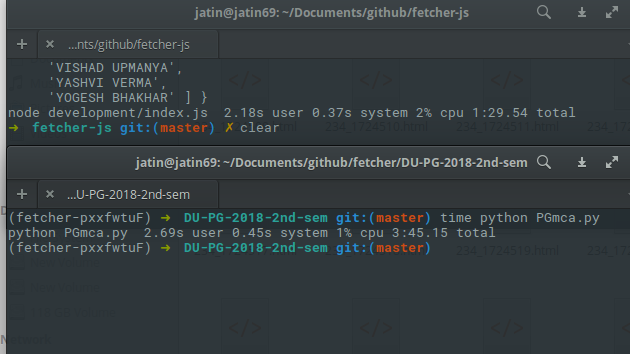

# FetcherJS

Node.js Version of [DU Result fetcher](https://github.com/jatin69/du-result-fetcher).
The aim is to improve the speed in comparison to python Version by using Concurrency.

## Proof of Concept

Checkout the [Proof of Concept](./POC/).

comparison with the python version. It reduced the time to half for 50 students. For 800 students, the improvements should be even more.

## Thoughts

- Concurrency is the MAJOR goal here
    - [Promise.all()](https://developer.mozilla.org/en-US/docs/Web/JavaScript/Reference/Global_Objects/Promise/all) is the way to go.
- a way to fetch the URL with options, (fetch, request-promise) - Checkout [wretch](https://github.com/elbywan/wretch)
- find a html parser, similar to beautifulsoup (jsdom, x-ray, ?)
- a in-memory database for when the data gets too large, (lokijs)